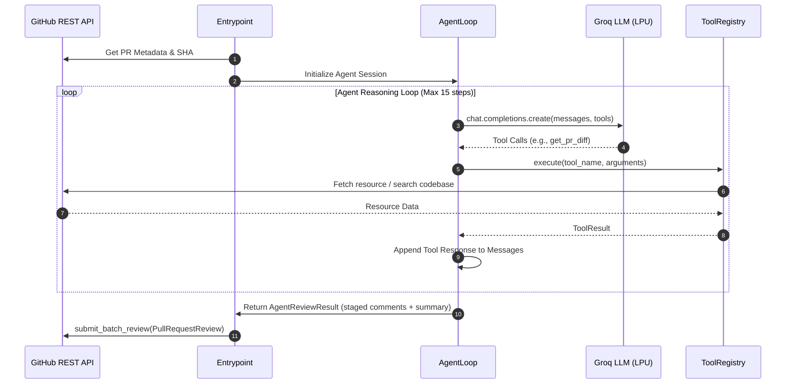

# 🤖 AI-Powered PR Review Bot (GitHub Action)

[](https://github.com/your-username/pr-review-bot)
[](https://www.python.org/downloads/)
[](https://groq.com)
[](https://github.com/features/actions)
[](https://opensource.org/licenses/MIT)

An autonomous, multi-step **AI code review agent packaged as a Docker-based GitHub Action**. Unlike single-prompt diff summarizers, this bot executes a **ReAct tool-calling loop** powered by Groq's high-throughput LPU inference (`llama-3.3-70b-versatile`). It selectively inspects PR diffs, fetches surrounding codebase context, scans for cross-file caller regressions, and posts batch inline and summary reviews directly to GitHub Pull Requests in seconds.

---

## 📑 Table of Contents
- [Architecture & System Design](#-architecture--system-design)
- [Key Engineering Decisions & Interview Defense](#-key-engineering-decisions--interview-defense)
  - [1. Why Python + Docker Action vs. JavaScript Native Action?](#1-why-python--docker-action-vs-javascript-native-action)
  - [2. Why Groq for CI/CD Time Horizons?](#2-why-groq-for-cicd-time-horizons)
  - [3. Multi-Step Tool Calling vs. Monolithic Prompting](#3-multi-step-tool-calling-vs-monolithic-prompting)
- [Agent Tool Suite](#-agent-tool-suite)
- [Agent Reasoning Lifecycle](#-agent-reasoning-lifecycle)
- [Quick Start: Adding to Your Repository](#-quick-start-adding-to-your-repository)
- [Local Development & Offline Simulation](#-local-development--offline-simulation)
- [Testing & Quality Assurance](#-testing--quality-assurance)
- [Known Limitations & Future Roadmap](#-known-limitations--future-roadmap)
- [📄 Resume Highlights (Placement-Ready Bullet Points)](#-resume-highlights-placement-ready-bullet-points)

---

## 🏗️ Architecture & System Design

```
+-----------------------------------------------------------------------------------+
| GitHub PR Event (opened, synchronize)                                             |
+----------------------------------------+------------------------------------------+
                                         |
                                         v
+-----------------------------------------------------------------------------------+
| Docker Container Action Runner (entrypoint.py)                                     |
|  - Ingests GITHUB_EVENT_PATH, secrets, and environment parameters                 |
+----------------------------------------+------------------------------------------+
                                         |
            +----------------------------+----------------------------+
            |                                                         |
            v                                                         v
+-----------------------------+                           +-------------------------+
| GitHubClient Layer          |                           | ToolRegistry            |
| - PyGithub wrapper          |                           | - JSON Schema generator |
| - Exponential Backoff       |                           | - Dispatcher & Logger   |
| - Rate Limit Sentinel       |                           +------------+------------+
+-------------+---------------+                                        |
              |                                                        |
              +----------------------------+---------------------------+
                                           |
                                           v
+-----------------------------------------------------------------------------------+
| Agent Orchestration Loop (src/agent/loop.py)                                      |
|                                                                                   |
|   Step 1: get_pr_diff() + get_pr_metadata()                                       |
|   Step 2: get_file_content() / search_codebase() (Context Gathering)              |
|   Step 3: post_inline_comment() (Targeted Finding Staging)                        |
|   Step 4: post_summary_comment() (Risk Assessment & Review Checklist)             |
|                                                                                   |
|   Safeguards:                                                                     |
|     * Max Tool-Call Ceiling (default: 15)                                         |
|     * Non-blocking Advisory Mode (Never auto-merges or auto-approves)             |
|     * Resilient Fallback Flush on LLM / API errors                                |
+------------------------------------------+----------------------------------------+
                                           |
                                           v
+-----------------------------------------------------------------------------------+
| PullRequestReview Batch Submission (Inline Comments + Summary Markdown)          |
+-----------------------------------------------------------------------------------+
```

---

## 💡 Key Engineering Decisions & Interview Defense

### 1. Why Python + Docker Action vs. JavaScript Native Action?
- **The Problem**: GitHub Actions natively executes JavaScript via Node.js with zero container startup overhead. Running Python natively in GitHub Actions requires a composite action that downloads Python and runs `pip install` on every single PR run, adding **20–45 seconds of runtime penalty** per workflow run.
- **The Solution**: Packaging the bot as a **Docker Container Action** (`runs.using: docker`). 
- **The Tradeoff & Rationale**: 
  - The container action produces an **immutable, hermetic runtime** with Python 3.11, all dependencies, and native utilities (`ripgrep`, `git`) pre-compiled into cached image layers.
  - No environment drift or Python version fragmentation across host runners.
  - Zero dependency installation latency during the CI execution lifecycle.

### 2. Why Groq for CI/CD Time Horizons?
- **The Problem**: A multi-step agent loop making 5 to 8 sequential tool calls over traditional cloud GPU providers (e.g., standard OpenAI/Claude endpoints) takes **45 to 90 seconds**. In a fast-paced development workflow, slowing down the CI pipeline directly hurts developer productivity.
- **The Solution**: Groq's Language Processing Units (LPUs) deliver **300 to 800 tokens/second** on models like `llama-3.3-70b-versatile`.
- **The Outcome**: The entire 4-stage agent reasoning loop finishes in **under 4 to 8 seconds**, making automated AI code review practical as a synchronous pull request check.

### 3. Multi-Step Tool Calling vs. Monolithic Prompting
- **The Problem**: Monolithic prompts that dump the entire git diff into a single prompt suffer from token truncation, high hallucination rates, and lack surrounding repository awareness.
- **The Solution**: The ReAct tool-calling loop enables dynamic problem decomposition:
  1. Inspects the diff summary and PR metadata.
  2. Selectively reads surrounding file lines (`get_file_content`) only when needed.
  3. Scans across repository files (`search_codebase`) to detect whether a modified signature broke callers elsewhere in the codebase.
  4. Formulates line-anchored comments iteratively.

---

## 🛠️ Agent Tool Suite

Every tool is implemented with a strict JSON Schema standard compatible with OpenAI and Groq function-calling:

| Tool Name | Parameters | Purpose |
| :--- | :--- | :--- |
| `get_pr_diff` | `max_lines` (int) | Fetches the unified Git diff for the Pull Request. |
| `get_pr_metadata` | *None* | Retrieves PR title, description, author, and branch context. |
| `get_file_content` | `path` (str), `ref` (str), `max_lines` (int) | Fetches full file contents at a given commit/branch for surrounding context. |
| `search_codebase` | `query` (str), `file_pattern` (str), `max_results` (int) | Uses `ripgrep`/regex across the checked-out repo to find symbol callers and imports. |
| `post_inline_comment` | `file` (str), `line` (int), `comment` (str), `side` (str) | Stages an inline review finding anchored to a specific file and line. |
| `post_summary_comment`| `summary_text` (str), `risk_level` (str), `checklist` (list) | Stages the final executive summary review and risk assessment (`LOW`/`MEDIUM`/`HIGH`). |

---

## 🔄 Agent Reasoning Lifecycle



---

## 🚀 Quick Start: Adding to Your Repository

Create `.github/workflows/pr-review.yml` in your target repository:

```yaml
name: "AI Code Review"

on:
  pull_request:
    types: [opened, synchronize, reopened]

permissions:
  contents: read
  pull-requests: write
  issues: write

jobs:
  review:
    name: "Groq Agent PR Review"
    runs-on: ubuntu-latest
    steps:
      - name: Checkout repository
        uses: actions/checkout@v4
        with:
          fetch-depth: 0

      - name: Run AI PR Review Bot
        uses: your-username/pr-review-bot@v1
        with:
          groq_api_key: ${{ secrets.GROQ_API_KEY }}
          github_token: ${{ secrets.GITHUB_TOKEN }}
          model: "llama-3.3-70b-versatile"
          max_tool_calls: "15"
          enable_inline_comments: "true"
          log_level: "INFO"
```

### Action Inputs Configuration

| Input | Required | Default | Description |
| :--- | :---: | :---: | :--- |
| `groq_api_key` | **Yes** | — | API key from [Groq Cloud Console](https://console.groq.com) |
| `github_token` | **Yes** | `${{ github.token }}` | GitHub token for posting review comments |
| `model` | No | `llama-3.3-70b-versatile` | Groq model ID for agent reasoning |
| `max_tool_calls`| No | `15` | Safety cap on tool execution loop depth |
| `enable_inline_comments` | No | `true` | Post line-level comments on the diff |
| `log_level` | No | `INFO` | Verbosity (`DEBUG`, `INFO`, `WARNING`, `ERROR`) |

---

## 💻 Local Development & Offline Simulation

The bot includes an offline simulation mode in `sample_run.py` to test diffs and demo the agent locally without requiring GitHub Actions:

```bash
# 1. Clone repository and install dependencies
git clone https://github.com/your-username/pr-review-bot.git
cd pr-review-bot
python -m venv .venv
source .venv/bin/activate  # Or `.venv\Scripts\activate` on Windows
pip install -r requirements-dev.txt

# 2. Run offline mock demo (No API key needed)
python sample_run.py --diff tests/fixtures/buggy_pr_diff.diff --mock

# 3. List accessible Groq models for your API key
python sample_run.py --api-key YOUR_GROQ_API_KEY --list-models

# 4. Interactively choose from available models
python sample_run.py --diff tests/fixtures/buggy_pr_diff.diff --api-key YOUR_GROQ_API_KEY --select-model

# 5. Run live review with a specific model
python sample_run.py --diff tests/fixtures/buggy_pr_diff.diff --api-key YOUR_GROQ_API_KEY --model llama-3.1-8b-instant
```

---

## 🧪 Testing & Quality Assurance

The test suite contains 26 comprehensive unit and integration tests covering GitHub API rate limiting, retry backoff, JSON tool schemas, diff parsing, and agent loop safeguards:

```bash
# Run pytest with branch and statement coverage
pytest -v --cov=src --cov-report=term-missing tests/

# Run Ruff linter
ruff check .
```

### Key Test Cases:
- **Clean PR Scenario**: Verifies the agent detects low risk, posts 0 unnecessary inline comments, and outputs a clean markdown review.
- **Buggy PR Scenario**: Verifies detection of SQL injection, hardcoded API keys, off-by-one index errors, and posts line-anchored comments with `HIGH` risk assessment.
- **Max Tool Call Safeguard**: Enforces loop termination when reaching step ceiling, flushing partial review comments gracefully.
- **GitHub API Rate Limit Backoff**: Tests exponential backoff and retry when receiving HTTP 403 / 429 status codes.

---

## ⚠️ Known Limitations & Future Roadmap

- **Static Analysis vs. Runtime Execution**: The agent reviews code via static diff and codebase inspection; it does not execute test suites or build binaries dynamically in an isolated sandbox.
- **Cross-Repository Context**: The bot currently inspects files within the checked-out repository; external microservice dependencies are not traversed.
- **Diff Parsing Boundary**: Very large diffs (>5000 lines) are automatically truncated to fit within model context windows; use `get_file_content` for granular file exploration.

---

## 📄 Resume Highlights (Placement-Ready Bullet Points)

Tailored for **Software Development Engineer (SDE) / Platform Engineer** resumes (IIT Kharagpur placements):

- **Designed & Implemented Autonomous Code Review Agent**: Engineered a production-grade CI/CD tool packaged as a **Docker Container GitHub Action** utilizing **Groq LPU API** (`llama-3.3-70b-versatile`) and Python 3.11 to deliver automated, multi-step PR code reviews in **<8 seconds**.
- **Engineered Resilient Agent Orchestration Framework**: Built a 6-tool **ReAct orchestration engine** with JSON Schema function-calling, dynamic codebase search (`ripgrep`), and safe loop ceilings (max 15 steps) with graceful fallback to prevent infinite execution and runaway API costs.
- **Production-Grade API Integration & Fault Tolerance**: Developed a resilient GitHub REST API wrapper with **exponential backoff**, rate-limit monitoring, and unified diff line-mapping for batch `PullRequestReview` submissions.
- **Comprehensive Testing & CI Pipeline**: Achieved **74%+ test coverage across 26 unit and integration tests** using Pytest and Ruff, validating offline simulations, mock event payloads, and AST-level bug detection (SQL injection, boundary errors).
